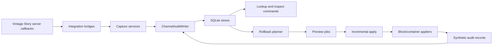

# WorldAudit


Server-side block, container, lookup, and rollback auditing for Vintage Story.

WorldAudit records what changed in your world, who changed it, when it changed, and what likely caused it. It gives server admins and moderators in-game tools to inspect history, investigate griefing, preview rollback or restore work before touching the world, and keep moderator actions inside the same audit trail.

Useful links:

- [Release notes](RELEASE_NOTES.md)
- [Benchmark notes](benchmarks/WorldAudit.Benchmarks/README.md)
- [Support Discord](https://discord.gg/5365aHU7rt)
- [License](LICENSE.txt)

## Table of Contents

- [Overview](#overview)
- [Why WorldAudit](#why-worldaudit)
- [Feature Highlights](#feature-highlights)
- [Runtime Flow](#runtime-flow)
- [What Gets Logged](#what-gets-logged)
- [Installation](#installation)
- [Quick Start](#quick-start)
- [Command Reference](#command-reference)
- [Filter Syntax](#filter-syntax)
- [Permissions](#permissions)
- [Configuration](#configuration)
- [Telemetry and Privacy](#telemetry-and-privacy)
- [Storage, Performance, and Maintenance](#storage-performance-and-maintenance)
- [Architecture](#architecture)
- [Development](#development)
- [Testing and Benchmarks](#testing-and-benchmarks)
- [Operational Notes](#operational-notes)
- [Troubleshooting](#troubleshooting)
- [Contributing](#contributing)

## Overview

WorldAudit is a `Server`-side Vintage Story mod that stores audit data in SQLite and exposes an in-game `/worldaudit` command tree with the `/wa` root alias.

The mod is designed around four jobs:

1. Capture world mutations without depending on an external database.
2. Help admins investigate suspicious edits or container theft directly in game.
3. Build rollback and restore previews before any change is applied.
4. Apply remediation incrementally and re-audit those admin actions afterward.

At release `1.0.0`, the mod includes:

- Block mutation auditing with actor, cause, action, position, timestamp, and before/after block state.
- Container transaction auditing with before/after snapshots and slot-level deltas.
- Inspect mode for quick in-world review of recent history.
- Nearby and filtered lookup commands.
- Preview-first rollback, restore, and undo workflows.
- Incremental rollback execution to avoid forcing large corrections through one tick.
- SQLite maintenance helpers for retention, purge, checkpointing, optimize, queue monitoring, and consumer pause or resume control.

## Why WorldAudit

WorldAudit is built for the common server-admin problems that happen after launch:

- A player reports griefing and you need to know exactly what changed.
- A chest was emptied and you need item movement history, not just block history.
- You want to preview the blast radius of a rollback before committing to it.
- A legitimate build was removed and needs to be restored from recorded history.
- You want moderator rollback activity to remain visible in the same audit record.
- You want a local, file-based persistence model instead of running a separate database service.

## Feature Highlights

| Area | What you get |
| --- | --- |
| Audit capture | Block placement, breakage, replacement, restore, and container movement history written to SQLite. |
| Investigation | `/wa inspect`, `/wa lookup`, and `/wa near` for in-world history review. |
| Remediation | Preview rollback or restore jobs, inspect them, then apply them later. |
| Safety | Rollback and restore actions are synthetic events that are logged too. |
| Operations | Queue health, WAL size, checkpoint state, maintenance runs, and purge previews. |
| Packaging | Release packaging includes native SQLite assets for `win-x64`, `linux-x64`, `linux-arm64`, and `osx-x64`. |

## Runtime Flow



The key runtime behaviors are:

- Engine callbacks are translated into application models by Vintage Story bridge classes.
- Captured events are queued through `ChannelAuditWriter`, then batched into SQLite writes.
- Query commands read the same history store that rollback planning uses.
- Rollback and restore jobs are previewed first, then executed on later ticks when you run `/wa apply <jobId>`.
- Admin-applied world changes are recorded as audit events with rollback or restore causes so the trail stays complete.

## What Gets Logged

### Block audit events

Each block event can include:

- World identifier
- Absolute position
- Chunk coordinates for indexed radius queries
- Timestamp
- Actor name and synthetic flag
- Cause such as player, fire, explosion, gravity, decay, rollback, or restore
- Action such as place, break, replace, or restore
- Previous block code
- New block code
- Optional old and new block entity snapshots
- Source rollback job metadata when the event was generated by a remediation job

### Container audit transactions

Each container transaction can include:

- World identifier and position
- Inventory type and optional container label
- Actor and cause
- Full before and after container snapshots
- Per-slot item delta lines
- Source rollback job metadata when applicable

### Rollback jobs

Preview and apply workflows store:

- Requesting actor
- Operation type (`rollback` or `restore`)
- Filter summary
- Job state
- Planned and applied counts
- Conflict and failure counts
- Per-entry execution results
- Oldest target timestamp for context

## Installation

### Server installation

1. Download a packaged release zip or build your own `WorldAudit-vintagestory.zip`.
2. Copy the zip into your Vintage Story server `Mods` folder.
3. Start the server once so WorldAudit can generate its config.
4. Review `worldaudit.json` before production use.
5. Grant command privileges only to trusted admins or moderators.

WorldAudit is server-side only. The mod metadata advertises `side: Server`, and the runtime is only loaded on the server app side.

### First-run checklist

Before using the mod on a live world, review these items:

- Choose where the SQLite database should live.
- Decide whether you want retention-based cleanup.
- Set rollback throughput to match your server hardware and tick budget.
- Review the Discord telemetry settings and disable or replace them if you do not want outbound notifications.
- Decide which staff roles should have inspect, lookup, rollback, purge, and reload access.

### Compatibility and packaging

- Mod id: `worldaudit`
- Current version: `1.0.0`
- Side: `Server`
- Game dependency: `*`
- Target framework: `.NET 8`
- Packaged SQLite native runtimes: `win-x64`, `linux-x64`, `linux-arm64`, `osx-x64`

## Quick Start

### Common admin workflow

1. Turn on inspect mode with `/wa inspect`.
2. Interact with a block or container to see recent history.
3. Use `/wa lookup` or `/wa near` for broader investigation.
4. Create a rollback or restore preview with filters.
5. Review the job using `/wa job <jobId>`.
6. Apply it only when you are satisfied with the preview.

### Example commands

```text
/wa inspect
/wa near t:1d
/wa lookup u:PlayerName r:10 p:20
/wa lookup u:#fire t:6h
/wa rollback u:PlayerName t:2h r:12
/wa restore t:30m r:5
/wa job 42
/wa apply 42
/wa status
/wa purge t:30d
```

### Typical use cases

#### Investigate grief around you

```text
/wa near t:12h
```

#### Inspect one player in a larger area

```text
/wa lookup u:PlayerName r:20 t:2d
```

#### Look for natural or system-caused changes

```text
/wa lookup u:#fire t:1d
/wa lookup u:#gravity t:4h
```

#### Preview a rollback before applying it

```text
/wa rollback u:PlayerName t:2h r:12
/wa job 42
/wa apply 42
```

#### Restore a recent area after a mistake

```text
/wa restore t:45m r:8
```

#### Reverse a completed admin operation

```text
/wa undo 42
```

## Command Reference

WorldAudit registers `/worldaudit` with `/wa` as the root alias.

| Command | Alias | Privilege | Purpose |
| --- | --- | --- | --- |
| `/wa help` | none | `Privilege.chat` | Show basic help text. |
| `/wa inspect` | `i` | `worldaudit.inspect` | Toggle inspect mode and review a block or container by interacting with it. |
| `/wa lookup [filters]` | `l` | `worldaudit.lookup` | Search audit history around your current position. |
| `/wa near [filters]` | none | `worldaudit.lookup` | Search nearby history using the configured default near radius. |
| `/wa rollback [filters]` | `rb` | `worldaudit.rollback` | Create a rollback preview job from filtered nearby history. |
| `/wa restore [filters]` | `rs` | `worldaudit.restore` | Create a restore preview job from filtered nearby history. |
| `/wa undo <jobId>` | none | `worldaudit.restore` | Build a preview job that inverts a completed rollback or restore job. |
| `/wa apply <jobId>` | none | `worldaudit.rollback` | Queue a preview job for execution. |
| `/wa jobs` | none | `worldaudit.rollback` | Show recent rollback and restore jobs. |
| `/wa job <jobId>` | none | `worldaudit.rollback` | Show one job in detail. |
| `/wa status` | none | `worldaudit.status` | Show database, queue, maintenance, and rollback status. |
| `/wa reload` | none | `worldaudit.reload` | Reload the config and rebuild runtime services. |
| `/wa consumer <pause|resume>` | none | `worldaudit.consumer` | Pause or resume database consumption. |
| `/wa purge t:<age>` | none | `worldaudit.purge` | Preview an age-based purge. |
| `/wa purge confirm t:<age>` | none | `worldaudit.purge` | Execute the purge. |

## Filter Syntax

The lookup parser is shared across lookup, nearby search, rollback preview, and restore preview workflows.

| Token | Meaning | Example | Notes |
| --- | --- | --- | --- |
| `t:<time>` | Time range or duration | `t:30m`, `t:2h`, `t:7d`, `t:7d-1d` | Supports `s`, `m`, `h`, `d`, and `w` suffixes. Two-value ranges are allowed. |
| `r:<radius>` | Search radius | `r:12` | Radius must be a positive integer. |
| `u:<user>` | Actor name | `u:PlayerName` | Case-insensitive actor lookup. |
| `u:#<cause>` | Cause filter | `u:#fire` | `#` is optional in parsing but useful for readability. |
| `a:<action>` | Block action filter | `a:break` | Valid actions are `place`, `break`, `replace`, and `restore`. |
| `i:<codes>` | Include codes | `i:game:chest,game:trunk` | Comma-separated list. |
| `e:<codes>` | Exclude codes | `e:game:air` | Comma-separated list. |
| `p:<count>` | Page size | `p:20` | Primarily affects lookup output page size. |
| `-b` | Blocks only | `-b` | Use to limit results to block history. |
| `-c` | Containers only | `-c` | Use to limit results to container history. |

### Supported cause values

WorldAudit recognizes these audit causes:

- `player`
- `fire`
- `explosion`
- `gravity`
- `liquid`
- `decay`
- `worldgen`
- `system`
- `rollback`
- `restore`
- `unknown`

### Supported action values

Valid block actions are:

- `place`
- `break`
- `replace`
- `restore`

### Filter examples

```text
/wa lookup t:1d r:10
/wa lookup u:PlayerName t:2h a:break
/wa lookup u:#explosion t:30m
/wa lookup i:game:chest -c
/wa rollback u:PlayerName t:45m r:8
/wa restore t:3h r:6 -b
```

## Permissions

WorldAudit registers the following privileges:

| Privilege | Recommended use |
| --- | --- |
| `worldaudit.inspect` | Staff who need point-and-click history checks. |
| `worldaudit.lookup` | Staff who should be able to run normal history lookups. |
| `worldaudit.lookup.block` | Registered by the mod for block lookup policy; not directly enforced by the shipped command handlers today. |
| `worldaudit.lookup.container` | Registered by the mod for container lookup policy; not directly enforced by the shipped command handlers today. |
| `worldaudit.rollback` | Staff allowed to preview, inspect, and apply rollback jobs. |
| `worldaudit.restore` | Staff allowed to preview restore jobs and create undo jobs. |
| `worldaudit.purge` | Trusted admins only. Deletes historical data. |
| `worldaudit.reload` | Trusted admins only. Rebuilds runtime services from config. |
| `worldaudit.status` | Staff who need operational visibility. |
| `worldaudit.consumer` | Trusted admins only. Can pause or resume persistence. |
| `worldaudit.admin` | Reserved elevated admin privilege registered by the mod. |

All chat commands also require the base `Privilege.chat` permission enforced by Vintage Story.

## Configuration

WorldAudit reads and writes `worldaudit.json`. If the file is missing or invalid, the mod generates a new one using its built-in defaults.

Important behavior:

- Relative `DatabasePath` values resolve inside the WorldAudit data directory.
- The database is opened in SQLite WAL mode.
- Rollback and maintenance timing values are all hot-reloadable through `/wa reload`, unless rollback jobs are already active.

### Trimmed example config

This is a practical starting point, not a full dump of every property:

```json
{
  "DatabasePath": "worldaudit.db",
  "DefaultPageSize": 10,
  "DefaultNearRadius": 6,
  "RollbackPreviewLimit": 5000,
  "RollbackMaxBlocksPerTick": 100,
  "RollbackTickIntervalMilliseconds": 50,
  "RetentionDays": 30,
  "CheckpointIntervalMinutes": 30,
  "CheckpointWalSizeMegabytes": 64,
  "OptimizeIntervalHours": 24,
  "EnableDiscordTelemetry": false
}
```

### Storage and write pipeline settings

| Setting | Default | What it controls |
| --- | --- | --- |
| `DatabasePath` | `worldaudit.db` | SQLite database file location. Relative paths resolve under the WorldAudit data path. |
| `WriterBatchSize` | `128` | Maximum number of audit items persisted in a single writer batch. |
| `WriterMaxFlushDelayMilliseconds` | `250` | Maximum time the writer waits before flushing a partial batch. |
| `SqliteBusyTimeoutMilliseconds` | `5000` | SQLite busy timeout for locked-database situations. |
| `SlowFlushThresholdMilliseconds` | `50` | Duration threshold used to count and report slow write flushes. |

### Query and rollback settings

| Setting | Default | What it controls |
| --- | --- | --- |
| `DefaultPageSize` | `8` | Default number of rows shown by lookup-style commands. |
| `DefaultNearRadius` | `5` | Default radius for `/wa near`. |
| `ChunkSize` | `32` | Chunk grouping size used for indexed queries and rollback planning. |
| `RollbackPreviewLimit` | `5000` | Maximum number of source records considered for preview creation. |
| `RollbackMaxBlocksPerTick` | `100` | Maximum rollback block entries processed per tick batch. |
| `RollbackTickIntervalMilliseconds` | `50` | Tick interval used for rollback and scheduled maintenance work. |
| `SlowQueryThresholdMilliseconds` | `25` | Duration threshold used to count and report slow queries. |

### Maintenance settings

| Setting | Default | What it controls |
| --- | --- | --- |
| `RetentionDays` | `0` | Automatic retention period. `0` disables age-based purge. |
| `CheckpointIntervalMinutes` | `30` | Scheduled WAL checkpoint interval. |
| `CheckpointWalSizeMegabytes` | `64` | WAL size threshold that can trigger checkpointing. |
| `OptimizeIntervalHours` | `24` | Scheduled SQLite optimize interval. |

### Capture and cause-classification settings

| Setting | Default | What it controls |
| --- | --- | --- |
| `EnableBlockAudit` | `true` | Enables block audit capture. |
| `EnableContainerAudit` | `true` | Enables container audit capture. |
| `EnableNaturalCauseAudit` | `true` | Enables cause classification beyond direct player actions. |
| `EnableFireCauseProvider` | `true` | Enables fire cause hints. |
| `EnableExplosionCauseProvider` | `true` | Enables explosion cause hints. |
| `EnableGravityCauseProvider` | `true` | Enables gravity cause hints. |
| `EnableDecayCauseProvider` | `true` | Enables decay cause hints. |
| `EnableSystemCauseProvider` | `true` | Enables system cause hints. |
| `EnableWorldgenCauseProvider` | `true` | Enables worldgen cause hints. |
| `VerboseDiagnostics` | `false` | Enables additional diagnostics logging for slow paths and maintenance behavior. |

### Telemetry settings

| Setting | Default | What it controls |
| --- | --- | --- |
| `EnableDiscordTelemetry` | `true` | Enables outbound Discord webhook notifications for startup and failure telemetry. |
| `DiscordWebhookUrl` | generated default | Webhook destination used by the telemetry client. Review or replace before production use. |
| `DiscordChannelId` | generated default | Required by current config validation; keep populated if telemetry remains enabled. |
| `DiscordTelemetryTimeoutSeconds` | `5` | HTTP timeout for telemetry delivery. |
| `IncludeOnlinePlayerNamesInTelemetry` | `true` | Includes online player names in telemetry payloads instead of only counts. |

## Telemetry and Privacy

WorldAudit includes an optional Discord webhook telemetry path. If telemetry is enabled, the runtime can send notifications for:

- Startup
- Unhandled exceptions
- Unobserved task exceptions
- Maintenance failures

Payloads can include:

- Server endpoint and port
- World name and world id
- Runtime status summary
- Database path
- Machine name
- Process id and architecture
- .NET and OS information
- Online player count
- Online player names when `IncludeOnlinePlayerNamesInTelemetry` is `true`

Recommended production posture:

1. Decide whether you want any outbound telemetry at all.
2. If not, set `EnableDiscordTelemetry` to `false`.
3. If yes, replace the generated webhook settings with infrastructure you control.
4. Consider setting `IncludeOnlinePlayerNamesInTelemetry` to `false` if you want to reduce personally identifiable runtime detail.

## Storage, Performance, and Maintenance

WorldAudit is built around SQLite with WAL mode and a single-reader batched queue writer.

### Storage model

- SQLite is opened in `ReadWriteCreate` mode with shared cache.
- Connection startup applies `PRAGMA journal_mode=WAL`.
- Foreign keys are enabled.
- Busy timeout is configurable.
- Schema migrations are versioned in a `schema_migrations` table.

### Queue writer behavior

- Captured events are enqueued immediately.
- A background consumer batches block events and container transactions.
- Flush requests complete or throw if the consumer faults.
- The writer tracks pending item count, flush count, batch size, and slow-flush metrics.
- The consumer can be paused or resumed with `/wa consumer pause` and `/wa consumer resume`.

### Maintenance behavior

WorldAudit can:

- Preview and execute age-based purges
- Run scheduled or threshold-triggered WAL checkpoints
- Run SQLite optimize on a timer
- Skip maintenance when rollback jobs are active
- Surface maintenance results through `/wa status`

### Rollback execution behavior

- Rollbacks and restores are previewed before apply.
- Execution is incremental across future ticks.
- Jobs store planned counts, applied counts, conflicts, failures, and per-entry outcomes.
- Undo builds a fresh preview from a completed job's applied history.

## Architecture

The project is intentionally split into small, focused layers instead of one large command or repository type.

### Repository layout

```text
WorldAudit/
  Application/      Use-case services, parsers, DTOs, and interfaces
  Domain/           Immutable records, enums, and query models
  Infrastructure/   SQLite persistence, schema migration, native loading, queue writer
  Integration/      Vintage Story adapters and rollback appliers
  Mod/              Mod bootstrap, config loading, runtime binding, telemetry
  Presentation/     Chat commands and result formatting
tests/
  WorldAudit.Tests/ xUnit coverage for capture, queries, rollback, config, telemetry
benchmarks/
  WorldAudit.Benchmarks/ BenchmarkDotNet performance checks
```

### Important runtime collaborators

| Component | Responsibility |
| --- | --- |
| `WorldAuditModSystem` | Server bootstrap, privilege registration, config load, runtime bind, lifecycle hooks. |
| `WorldAuditRuntime` | Composes the runtime and exposes capture, query, maintenance, and rollback services. |
| `ChannelAuditWriter` | Queues and batches writes to SQLite. |
| `SqliteSchemaMigrator` | Creates and upgrades the schema. |
| `SqliteAuditRepository` | Thin adapter over focused write, query, rollback, and maintenance stores. |
| `BlockMutationCaptureService` | Classifies block mutation observations before persistence. |
| `ContainerTransactionCaptureService` | Converts container activity into transaction records. |
| `RollbackPlanner` | Builds preview jobs from filtered history. |
| `RollbackExecutionCoordinator` | Applies queued jobs incrementally and records outcomes. |
| `WorldAuditChatCommands` | Registers the `/wa` command tree and delegates to focused handlers. |

### Schema highlights

The SQLite schema currently includes tables for:

- `worlds`
- `actors`
- `causes`
- `actions`
- `blocks`
- `block_events`
- `inventory_types`
- `items`
- `container_transactions`
- `container_transaction_lines`
- `rollback_jobs`
- `rollback_job_entries`
- `schema_migrations`

The database is indexed for exact-position lookup, radius lookup, actor or cause lookup, and rollback job execution order.

## Development

### Prerequisites

- .NET 8 SDK
- A resolvable `VintagestoryAPI.dll` for compile-time reference

### Resolving the Vintage Story API assembly

The build resolves `VintagestoryAPI.dll` in this order:

1. `VintageStoryApiPath` MSBuild property
2. `VINTAGESTORY_API_PATH` environment variable
3. `%APPDATA%\Vintagestory\VintagestoryAPI.dll`

If none of those resolve to a real file, the build fails with a clear error.

### Build

```powershell
dotnet build WorldAudit.slnx
```

### Test

```powershell
dotnet test WorldAudit.slnx
```

### Publish and package

```powershell
dotnet publish .\WorldAudit\WorldAudit.csproj -c Release
```

The publish target prepares:

- `WorldAudit/bin/Release/net8.0/publish/`
- `WorldAudit/bin/Release/net8.0/vintagestory-package/`
- `WorldAudit/bin/Release/net8.0/WorldAudit-vintagestory.zip`

### Override packaged native runtimes

By default the publish pipeline includes:

- `win-x64`
- `linux-x64`
- `linux-arm64`
- `osx-x64`

Override that set with:

```powershell
dotnet publish .\WorldAudit\WorldAudit.csproj -c Release -p:VintageStoryNativeRuntimeIdentifiers="win-x64;linux-x64"
```

### Benchmark runner

```powershell
dotnet run --project .\benchmarks\WorldAudit.Benchmarks\WorldAudit.Benchmarks.csproj -c Release
```

## Testing and Benchmarks

The repository includes xUnit coverage and a BenchmarkDotNet project.

### Tested areas

- Block change capture
- Block mutation classification
- Channel writer fault handling and flushing
- Lookup and purge parsing
- Inspect and chat formatting
- Inspector state tracking
- SQLite repository behavior
- Rollback planning and workflow persistence
- Maintenance processing
- Config validation
- Telemetry payload formatting
- Vintage Story integration helpers

### Benchmark scenarios

The benchmark project currently exercises:

- Exact block history lookup
- Radius-based block lookup
- Rollback block selection
- Radius-based container lookup
- Writer flush throughput
- Block-mutation classification

## Operational Notes

- Grant rollback, purge, reload, and consumer controls only to trusted staff.
- Start with preview jobs, review them, and apply only after inspection.
- Consider regular world backups even though rollback and restore are available.
- Set `RetentionDays` if you do not want the audit database to grow indefinitely.
- Watch `/wa status` on busy servers to understand WAL growth, queue backlog, and maintenance cadence.
- If you expect large rollback jobs, tune `RollbackMaxBlocksPerTick` and `RollbackTickIntervalMilliseconds` conservatively first, then increase as needed.
- Relative database paths keep the audit store inside the mod's data area; absolute paths are useful when you want to place the DB on a different disk.

## Troubleshooting

### `VintagestoryAPI.dll was not found`

Provide the API path explicitly:

```powershell
dotnet build .\WorldAudit\WorldAudit.csproj -p:VintageStoryApiPath="C:\Games\Vintagestory\VintagestoryAPI.dll"
```

Or set the environment variable:

```powershell
$env:VINTAGESTORY_API_PATH = "C:\Games\Vintagestory\VintagestoryAPI.dll"
```

### Rollback preview is too broad or too narrow

Refine the query with:

- Smaller or larger `r:<radius>`
- Shorter or longer `t:<time>`
- `u:<player>` or `u:#<cause>`
- `i:<codes>` and `e:<codes>`
- `-b` or `-c` to narrow scope

### Database growth is larger than expected

Review:

- `RetentionDays`
- Scheduled checkpoints and optimize intervals
- Manual purge preview with `/wa purge t:<age>`
- WAL size in `/wa status`

### Staff are missing commands

Verify:

- They have `Privilege.chat`
- They have the appropriate `worldaudit.*` privilege
- You reloaded permissions or restarted the server after permission changes

### Telemetry should not leave the server

Disable it explicitly:

```json
{
  "EnableDiscordTelemetry": false
}
```

## Contributing

Issues and pull requests are welcome.

When contributing, prefer the same design direction used in the codebase:

- Keep collaborators focused and single-purpose.
- Favor clear boundaries between domain, application, infrastructure, integration, and presentation code.
- Avoid turning command handlers or repositories into god classes.
- Add or update tests when behavior changes.
- Keep public docs and release notes in sync with user-facing changes.
